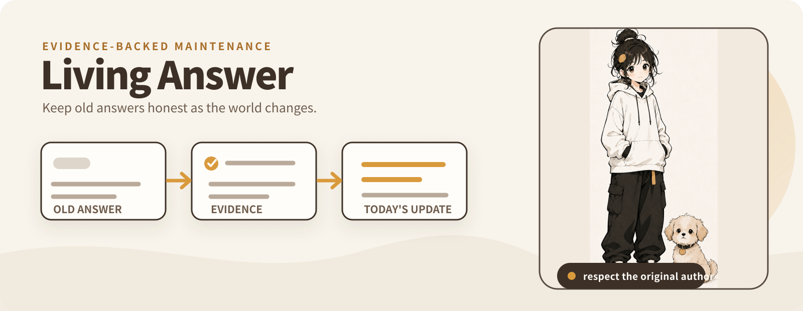

<p align="center">
  
</p>

# Living Answer

Living Answer helps readers see which important premises in an older Zhihu
answer have materially changed, what that means today, and which evidence
supports the update.

## One-command development

```bash
./dev.sh
```

On its first run, the script installs the pinned global Vite+ CLI if `vp` is
missing, installs the project-pinned Node.js runtime and dependencies, checks
the environment, and starts the TanStack Start development server. Use the URL
printed by Vite; the project does not assume a fixed port. Stop it with
`Ctrl+C`.

The first run changes the user-level Vite+ installation. This is intentional.

## Manual commands

```bash
vp env install
vp env doctor
vp install --frozen-lockfile
vp dev
```

Validation:

```bash
vp check
vp test
vp build
```

## Troubleshooting

When something looks off, run the doctor first. It reports Node version,
package manager, and Vite+ installation status in one place.

```bash
vp env doctor
```

### Port already in use

`vp dev` does not assume a fixed port. If a previous session left a process
bound to the printed port, stop it (the address is shown in the dev output)
or let the next run pick a new one.

```bash
# list processes for the printed port
# macOS / Linux
lsof -i :<port>
# Windows
netstat -ano | findstr :<port>
```

### Dependencies drifted

`vp install` rewrites the lockfile. To restore a clean state from the
pinned lockfile:

```bash
vp install --frozen-lockfile
vp check
```

### Wrong Node version

The project pins Node 24 LTS via `devEngines`. If `vp env doctor` reports
the wrong runtime, install the pinned version and re-run:

```bash
vp env install
```

## Current boundary

The current real-data path accepts a Zhihu answer URL, resolves a summary-class
`AnswerExcerpt` through the official search API, extracts anchored and
time-sensitive claims, retrieves Zhihu and global search candidates, applies an
evidence gate, and produces an advisory patch result. Provider failures, rate
limits, and durable daily quota limits are surfaced as safe, localized
read-facing failures.

Living Answer deliberately does **not** generate a new full answer or treat an
excerpt as the original answer. The official open API surface observed in
Spike 01 provides summary-class content rather than a documented full-answer
path, so `AnswerExcerpt` remains a separate immutable observation. It must never
be stored as an `AnswerSnapshot.body`.

Development state is persisted under ignored `.local/` storage:

- `AnswerExcerpt` observations.
- Claim sets keyed by excerpt fingerprint.
- Evidence-candidate retrieval events and candidates.
- Daily provider quota usage.

The product still lacks durable `PatchRevision`, a Changes timeline, recheck,
and the minimal dispute flow. Golden-demo pages remain separate demonstration
fixtures and are not presented as live API results. Full-answer ingestion,
public deployment, final UI polish, and claim-level evaluation remain explicitly
out of the current working slice.

## Engineering rules

- TanStack Start and Router own routes, loaders, server functions, and errors.
- Effect is used at external and workflow boundaries where typed failures,
  retries, validation, timeouts, or controlled concurrency help.
- Domain code does not import React, TanStack, SQLite, provider SDKs, or
  environment-specific paths.
- Provider pages, API payloads, comments, and model output are untrusted data
  and are validated before entering the domain.
- Credentials are read only in the server-function boundary and never exposed
  in responses, logs, or client state.
- Writable development state stays under ignored `.local/`.
- Tests use injected transports and never call real provider APIs.
